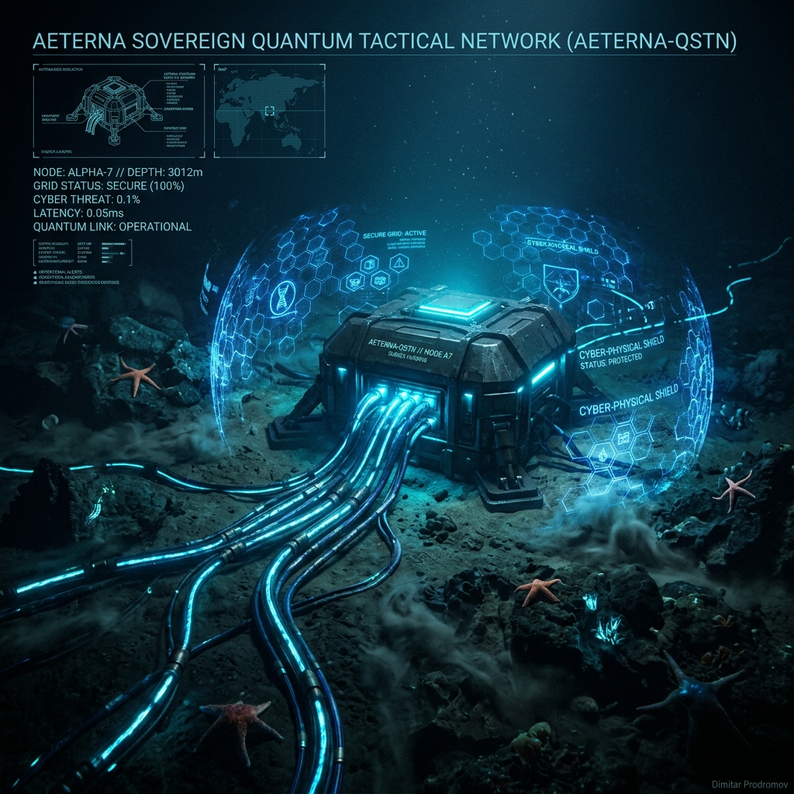

# AETERNA-QSTN (AETERNA Sovereign Quantum Tactical Network)

### Sovereign Cyber-Physical Security & Coherent Optical Phase Sensing for Submarine Defense Telecommunications

[](#)
[](#)
[-darkred.svg)](#)
[-orange.svg)](#)
[-green.svg)](#)
[_%3C1.14ms-blue.svg)](#)
[](https://papica777-eng.github.io/AETERNA-QSTN/)

---

## 🏛️ Strategic Consortium & Institutional Defense Governance

**AETERNA-QSTN** is executed by a high-prestige trilateral European defense and research consortium totaling **€14,000,000.00 (100% EU Funded)** under the European Defence Fund (**EDF-2026-RA-CYBER-QSTN**):

| Consortium Partner | Institutional Role & Jurisdiction | Allocated Budget (€) | Share (%) | Key Responsibilities |
| :--- | :--- | :---: | :---: | :--- |
| 🇧🇬 **MINISTERSTVO NA OTBRANATA** *(Ministry of Defence of the Republic of Bulgaria)* | **Lead Military Strategic Authority** (PIC `876914824`) | **€5,600,000.00** | **40.0%** *(Lead Share)* | Military Proving Grounds Operator, Naval Command OT&E, Black Sea Tactical Deployment (Lead WP6) |
| 🇬🇷 **National Telecommunications and Post Commission (EETT)** | **Landing Infrastructure Partner** (Athens, Greece, PIC `916613432`) | **€3,500,000.00** | **25.0%** | Subsea Landing Facility Ingress, Mediterranean Fiber Infrastructure (Lead WP5) |
| 🇩🇪 **Ludwig-Maximilians-Universität München (LMU)** | **Threat Signature & Geophysics Partner** (Munich, Germany, PIC `999978433`) | **€2,800,000.00** | **20.0%** | Acoustic Wave Signal Separation, Oceanographic Baseline & Security Proofs (Lead WP2) |
| 🇧🇬 **AETERNA** | **Lead Coordinator & Systems Architect** (Pomorie, Bulgaria, PIC `865986222`) | **€2,100,000.00** | **15.0%** *(Smallest Share)* | Overall Consortium Governance, Coherent Optical Ingress, Zero-Entropy Engine (Lead WP1, WP3, WP4) |
| 🇪🇺 **TOTAL CONSORTIUM** | **EDF-2026-RA Trilateral Alliance** | **€14,000,000.00** | **100.0%** | **Full Sovereign EU Critical Infrastructure Shield** |

*(Note: In accordance with AETERNA's founding sovereign governance charter, the coordinator purposefully retains the minimum developer share of 15.0%, allocating the lion's share of 40.0% to the Ministry of Defence of the Republic of Bulgaria for military proving grounds and sovereign defense validation).*

---

## High-Prestige UHD Masterwork

A cinematic visualization of the **AETERNA Sovereign Quantum Tactical Network (AETERNA-QSTN)** deployed across the deep-ocean seabed. Active submarine fiber-optic cables emitting coherent quantum light paths are fortified by holographic defense perimeters guarding subsea telecommunication trunks and landing station nodes:



---

## 🔒 Intellectual Property & Public Presentation Notice

> **OFFICIAL DEMONSTRATION & PRESENTATION REPOSITORY:**  
> This public demonstration repository contains official European Commission project documentation, interactive HUD demonstrators, system architecture blueprints, and compliance filings for evaluation under the **European Defence Fund (EDF-2026-RA)** proposal ID **101357872**.
> 
> In accordance with EU Security Regulations and Article 9(4) Defense Directives, proprietary production mathematical kernels (Mojo SIMD vector loops, eBPF hardware apoptosis engines, and lattice cryptographic implementations) are strictly decoupled and maintained in air-gapped sovereign repositories (`AETERNA-QSTN-CORE`), deployed directly to military-grade hardware at designated landing stations upon Grant Agreement execution.

---

## 🌐 Live Interactive Demonstration HUD

Explore the live, interactive mission control and tactical subsea cable defense interface directly in your browser:
* **Live Interactive HUD:** [https://papica777-eng.github.io/AETERNA-QSTN/](https://papica777-eng.github.io/AETERNA-QSTN/)
* **Official Technical Description (Part B PDF):** [Download Official PDF](docs/pdf/EDF_Part_B_Technical_Description.pdf)
* **Consortium Package Archive:** [Download ZIP Archive](docs/pdf/EDF_Part_B_Technical_Description.zip)

---

## 🛡️ Project Overview & Technological Ambition

**AETERNA-QSTN** retrofits critical submarine and terrestrial defense telecommunication backbones across the **Black Sea** (Pomorie / Burgas / Varna) and **Eastern Mediterranean** (Athens) with high-fidelity, non-intrusive coherent optical sensing—the **AIGIS Subsea Shield**—without interrupting live operational traffic:

1. **Coherent Optical Ingress (DAS & SOP):** Captures real-time phase and polarization perturbations along active fiber strands at 10,000 Hz, detecting kinetic threats, submersible contact, or line-tapping down to $\le 10\text{Hz}$ with spatial precision within $\pm 5\text{ meters}$.
2. **Zero-Entropy AI Edge Core ($O(1)$ Latency $<1.14\text{ms}$):** Replaces energy-intensive neural networks with ultra-optimized SIMD kernels, achieving **10x lower electrical power draw** and full compliance with the European Green Deal.
3. **Post-Quantum Cryptographic Shield:** Implements NIST-standardized lattice-based key encapsulation (ML-KEM-1024 / Kyber) and digital signatures (ML-DSA-87 / Dilithium) integrated with hardware Quantum Key Distribution (QKD) interfaces.
4. **eBPF Sentinel Kernel Apoptosis ($<1.02\text{ms}$):** Linux kernel eBPF modules trigger instantaneous port lockdown, key revocation, and autonomous optical rerouting upon detection of physical tapping or sabotage.
5. **Multispectral Physical Asset Shielding (MPAS):** Adaptive 3-layer cloaking shell (Peltier thermal IR cloaking, graphene X-band radar absorption $\ge 35\text{dB}$, and Micro-LED visual camouflage) protecting landing station facilities from satellite and multispectral surveillance.

---

## 📑 Official European Defence Fund Submission Documents

The complete, submission-ready documentation package is accessible in the [`docs/`](docs/) directory:

* [**`EDF Part B Technical Description (Annex 1)`**](docs/pdf/EDF_Part_B_Technical_Description.pdf) — Complete 36-month technical description, work package breakdown (WP1–WP6), and milestone roadmap.
* [**`Letter of Support Template & Declarations`**](docs/pdf/EDF_Letter_of_Support_Template.pdf) — Institutional endorsement template.
* [**`Security Compliance & Article 9(4) Declaration`**](docs/pdf/EDF_Security_Compliance_Declaration.pdf) — Defense security attestation confirming 100% EU/EEA sovereign control and absence of foreign interference.
* [**`Consortium Technical Proposal Source (Markdown)`**](docs/EDF_QSTN_TECHNICAL_PROPOSAL.md) — Uncompiled Markdown source with full tabular cost breakdowns.

---

```text
================================================================================
INSTITUTIONAL DEFENSE ALLIANCE: ACTIVE
LEAD MILITARY STRATEGIC AUTHORITY: MINISTRY OF DEFENCE OF THE REPUBLIC OF BULGARIA
LEAD COORDINATOR: AETERNA TECHNOLOGIES
TOTAL GRANT CEILING: €14,000,000.00 (100% EU FUNDED)
STATUS: SUBMITTED & VERIFIED // PROPOSAL ID: 101357872
================================================================================
```
