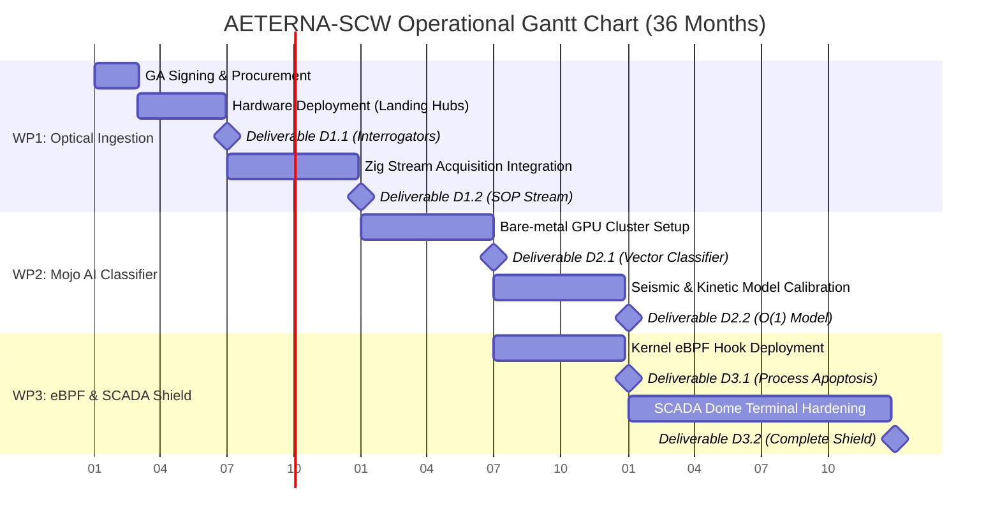

# AETERNA-SCW // PROJECT EXECUTION & OPERATIONAL PLAYBOOK
### Connecting Europe Facility (CEF Digital 2026) — Proposal ID: 101354145
**Lead Coordinator & Sovereign Systems Architect:** Dimitar Prodromov (AETERNA)  
**Total Allocated Project Budget:** €20,000,000 (€10,000,000 EU Co-funding at 50% matched)  

---

## 1. Executive Summary & Governance Structure

This Operational Playbook serves as the binding execution guide for Dimitar Prodromov (Sovereign Systems Architect) upon formal notification of grant approval from the European Health and Digital Executive Agency (HADEA).

### Governance & Roles
* **Project Coordinator:** AETERNA (Pomorie, Bulgaria) — Lead: Dimitar Prodromov (PIC: 865986222)
* **Partner 2:** Hellenic Submarine Telecom Authority (Athens, Greece) — Landing Point & SCADA Partner
* **Partner 3:** Munich Institute of Geophysics (LMU Munich, Germany) — Seismic Calibration & Telemetry Partner

---

## 2. Immediate Kickoff Phase (Days 1 – 60 Post-Approval)

| Action Item | Responsible Entity | Target Timeline | Verification / Deliverable |
| :--- | :--- | :--- | :--- |
| **1. Grant Agreement (GA) Signing** | AETERNA (Dimitar Prodromov) | Days 1 – 30 | Digitally signed GA on EU Funding & Tenders Portal |
| **2. Consortium Agreement (CA)** | AETERNA + Partners 2 & 3 | Days 15 – 45 | Signed internal IP & IP-rights agreement |
| **3. Dedicated Project Bank Account** | AETERNA | Days 1 – 20 | IBAN setup for 50% Pre-financing transfer (€1.25M initial) |
| **4. Kickoff Meeting & Board Setup** | Consortium Steering Committee | Day 60 | Official Project Kickoff Minutes & Work Plan Approval |

---

## 3. Work Package Execution Plan (36-Month Timeline)

---

## 4. Detailed Technical Duties for Dimitar Prodromov

### **YEAR 1: Hardware Procurement, DAS Deployment & Zig Stream Ingress**

#### **Duty 1.1: Technical Procurement & Hardware Specification (Months 1–3)**
* Issue RFP for Coherent DAS/SOP Interrogator units meeting the strict specifications:
  * Laser Coherence Length: `>100 km`
  * Phase Resolution: `<1 microradian`
  * Spatial Resolution: `2.0m along 150km`
  * Sampling Frequency: `10 kHz per channel`
* Procure dual AMD EPYC 9654 + 4x NVIDIA H100 PCIe (80GB VRAM) compute nodes for Bulgarian landing hubs.

#### **Duty 1.2: Subsea Terminal Installation & Zig Integration (Months 4–12)**
* Supervise physical installation of interrogator units at the Black Sea landing station.
* Finalize [`SOP_STREAM_ACQUISITION.zig`](file:///c:/Users/papic/Desktop/_PROJECTS_AND_WORKSPACES/AETERNA-SCW/src/ingress/SOP_STREAM_ACQUISITION.zig) for zero-copy PCIe DMA memory mapping.
* **Deliverable D1.1 (M6):** Interrogators Installation Report.
* **Deliverable D1.2 (M12):** SOP Stream Ingestion Validation.

---

### **YEAR 2: Mojo Neural Signal Separator & eBPF Sentinel Integration**

#### **Duty 2.1: Mojo Vectorized AI Core Deployment (Months 13–18)**
* Compile and deploy the Mojo inference engine [`scripts/simulation.mojo`](file:///c:/Users/papic/Desktop/_PROJECTS_AND_WORKSPACES/AETERNA-SCW/scripts/simulation.mojo) onto the bare-metal NVIDIA H100 nodes.
* Train SIMD vectorization loops with telemetry feeds from Munich Institute of Geophysics.
* Enforce $O(1)$ complexity with deterministic execution latency `<1.14ms`.
* **Deliverable D2.1 (M18):** Vectorized Signal Classifier Core.

#### **Duty 2.2: eBPF Apoptosis Reflex & Kernel Isolation (Months 19–24)**
* Deploy Linux kernel eBPF sentinel loops [`sovereign_sentinel.rs`](file:///c:/Users/papic/Desktop/_PROJECTS_AND_WORKSPACES/AETERNA-SCW/src/core/sovereign_sentinel.rs) and [`src/ebpf/apoptosis.c`](file:///c:/Users/papic/Desktop/_PROJECTS_AND_WORKSPACES/AETERNA-SCW/src/ebpf/apoptosis.c).
* Conduct live simulation tests for kinetic attacks (anchor drag, sonar tap). Verify process apoptosis in `<1.02ms`.
* **Deliverable D2.2 (M24):** Real-time Model Calibration.
* **Deliverable D3.1 (M24):** eBPF Sentinel Process Apoptosis.

---

### **YEAR 3: SCADA Hardening, NIS2 Audit & Commercial Rollout**

#### **Duty 3.1: AIGIS Dome SCADA Hardening (Months 25–36)**
* Harden SCADA interfaces using strict integer-only arithmetic [`aigis_dome.rs`](file:///c:/Users/papic/Desktop/_PROJECTS_AND_WORKSPACES/AETERNA-SCW/src/scada/aigis_dome.rs).
* Pass official NIS2 (Directive EU 2022/2555) and ISO/IEC 27001 security audits.
* **Deliverable D3.2 (M36):** SCADA Terminal Complete Hardening.

#### **Duty 3.2: Dual-Use Data Model Launch (Month 36+)**
* Connect free sovereign alert streams to EU CSIRTs & ENISA.
* Launch Open-Access Environmental API for oceanographic research networks.
* Launch commercial subscription telemetry services for Tier-1 telecom operators to fund post-grant operations.

---

## 5. Audit & Reporting Checklist

- [ ] **M18 Midterm Technical & Financial Audit:** Submit to HADEA via EU Portal.
- [ ] **M36 Final Project Audit:** Submit final financial statement and NIS2 attestation.
- [ ] **Article 9(4) Sovereignty Verification:** Re-certify 100% EU ownership and clean-room software stack.
