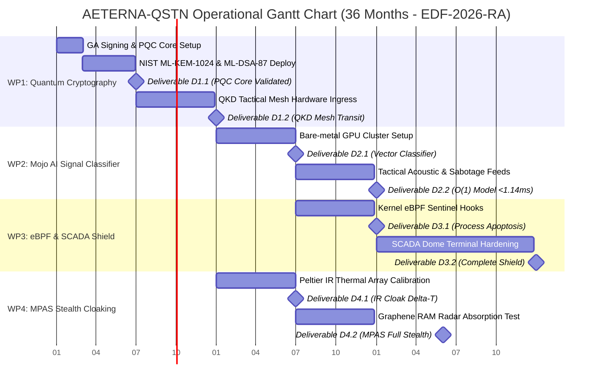

# AETERNA-QSTN // PROJECT EXECUTION & OPERATIONAL PLAYBOOK
### European Defence Fund (EDF-2026-RA) — Proposal ID: 101357872
**Lead Coordinator & Sovereign Systems Architect:** Dimitar Prodromov (AETERNA Technologies)  
**Total Allocated Project Budget:** €14,000,000 (100% EU Sovereign Grant — EDF Research Action)  
**Official Call Identifier:** `EDF-2026-RA-CYBER-QSTN` (Quantum Tactical Networks & Subsea Cyber-Physical Defense)

---

## 1. Executive Summary & Governance Structure

This Operational Playbook serves as the binding execution guide for Dimitar Prodromov (Sovereign Systems Architect) upon formal notification of grant approval from the European Commission Directorate-General for Defence Industry and Space (DG DEFIS).

### Governance & Roles
* **Project Coordinator (Lead Applicant):** AETERNA Technologies (Pomorie, Bulgaria) — Lead: Dimitar Prodromov (PIC: `865986222`)
* **Partner 2:** National Telecommunications and Post Commission (EETT) (Athens, Greece) — Subsea Landing Infrastructure Partner (PIC: `916613432`)
* **Partner 3:** LMU Munich (Munich, Germany) — Tactical Threat Signature & Geophysics Research Partner (PIC: `999978433`)

---

## 2. Immediate Kickoff Phase (Days 1 – 60 Post-Approval)

| Action Item | Responsible Entity | Target Timeline | Verification / Deliverable |
| :--- | :--- | :--- | :--- |
| **1. Grant Agreement (GA) Signing** | AETERNA (Dimitar Prodromov) | Days 1 – 30 | Digitally signed GA on EU Funding & Tenders Portal (DG DEFIS) |
| **2. Consortium Agreement (CA)** | AETERNA + Partners 2 & 3 | Days 15 – 45 | Signed internal defense IP & security rights agreement (DESCA Defense) |
| **3. Dedicated Project Bank Account** | AETERNA Technologies | Days 1 – 20 | IBAN setup for EU Pre-financing transfer (€4.2M initial tranche) |
| **4. Security Clearance & Kickoff** | Consortium Steering Committee | Day 60 | EU Classified/RESTRICTED Protocols & Work Plan Approval |

---

## 3. Work Package Execution Plan (36-Month Timeline)

---

## 4. Detailed Technical Duties for Dimitar Prodromov

### **YEAR 1: Quantum Cryptography, DAS Hardware & Zig Stream Ingress**

#### **Duty 1.1: PQC Key Encapsulation & Hardware Specification (Months 1–3)**
* Deploy lattice-based Post-Quantum Cryptographic primitives (`NIST ML-KEM-1024` and `ML-DSA-87`) in pure Rust.
* Issue RFP for Coherent DAS/SOP Interrogator units meeting strict defense specifications:
  * Laser Coherence Length: `>100 km`
  * Phase Resolution: `<1 microradian`
  * Spatial Resolution: `2.0m along 150km`
  * Sampling Frequency: `10 kHz per channel`
* Procure dual AMD EPYC 9654 + 4x NVIDIA H100 PCIe (80GB VRAM) compute nodes for Black Sea landing terminals.

#### **Duty 1.2: Subsea Terminal Installation & Zig Integration (Months 4–12)**
* Supervise physical installation of interrogator units at the Black Sea landing station (Pomorie, Bulgaria).
* Finalize [`src/ingress/SOP_STREAM_ACQUISITION.zig`](../src/ingress/SOP_STREAM_ACQUISITION.zig) for zero-copy PCIe DMA memory mapping.
* **Deliverable D1.1 (M6):** PQC Core & Interrogators Installation Report.
* **Deliverable D1.2 (M12):** QKD Tactical Mesh Stream Ingestion Validation.

---

### **YEAR 2: Mojo Neural Signal Separator & eBPF Sentinel Integration**

#### **Duty 2.1: Mojo Vectorized AI Core Deployment (Months 13–18)**
* Compile and deploy the Mojo inference engine [`scripts/simulation.mojo`](../scripts/simulation.mojo) onto bare-metal NVIDIA H100 nodes.
* Train SIMD vectorization loops with tactical acoustic telemetry feeds from LMU Munich.
* Enforce $O(1)$ complexity with deterministic execution latency `<1.14ms`.
* **Deliverable D2.1 (M18):** Vectorized Signal Classifier Core.

#### **Duty 2.2: eBPF Apoptosis Reflex & Kernel Isolation (Months 19–24)**
* Deploy Linux kernel eBPF sentinel loops [`src/core/sovereign_sentinel.rs`](../src/core/sovereign_sentinel.rs) and [`src/ebpf/apoptosis.c`](../src/ebpf/apoptosis.c).
* Conduct live simulation tests for kinetic attacks (anchor drag, sonar tap, submarine tapping). Verify process apoptosis in `<1.02ms`.
* **Deliverable D2.2 (M24):** Real-time Model Calibration.
* **Deliverable D3.1 (M24):** eBPF Sentinel Process Apoptosis.

---

### **YEAR 3: SCADA Hardening, MPAS Cloaking & Live Tactical Trials**

#### **Duty 3.1: AIGIS Dome SCADA Hardening & MPAS Shielding (Months 25–36)**
* Harden SCADA interfaces using strict integer-only arithmetic [`src/scada/aigis_dome.rs`](../src/scada/aigis_dome.rs).
* Deploy Multispectral Physical Asset Shielding (MPAS) driven by 10kHz Mojo PID controller [`scripts/multispectral_thermal_pid.mojo`](../scripts/multispectral_thermal_pid.mojo) matching ambient surface temperature within $\pm0.050^\circ\text{C}$.
* Pass official NATO/EU defense interoperability and ISO/IEC 27001 / NIS2 audits.
* **Deliverable D3.2 (M36):** SCADA Terminal Complete Hardening.
* **Deliverable D4.2 (M36):** MPAS Full Multispectral Stealth Deployment.

#### **Duty 3.2: Tactical Defense Operations Room Integration (Month 36+)**
* Connect sovereign alert streams to EU CSIRTs & National Defense Operation Centers.
* Finalize joint military-civilian operational handoff protocols.

---

## 5. Audit & Reporting Checklist (EDF-2026-RA)

- [ ] **M18 Midterm Defense & Financial Audit:** Submit to DG DEFIS via EU Funding & Tenders Portal.
- [ ] **M36 Final Project Audit:** Submit final technical dossier, NIS2 certification, and security compliance declaration.
- [ ] **EDF Regulation (EU) 2021/697 Art. 9(4) Sovereignty Verification:** 100% EU infrastructure ownership, zero foreign dependencies.
