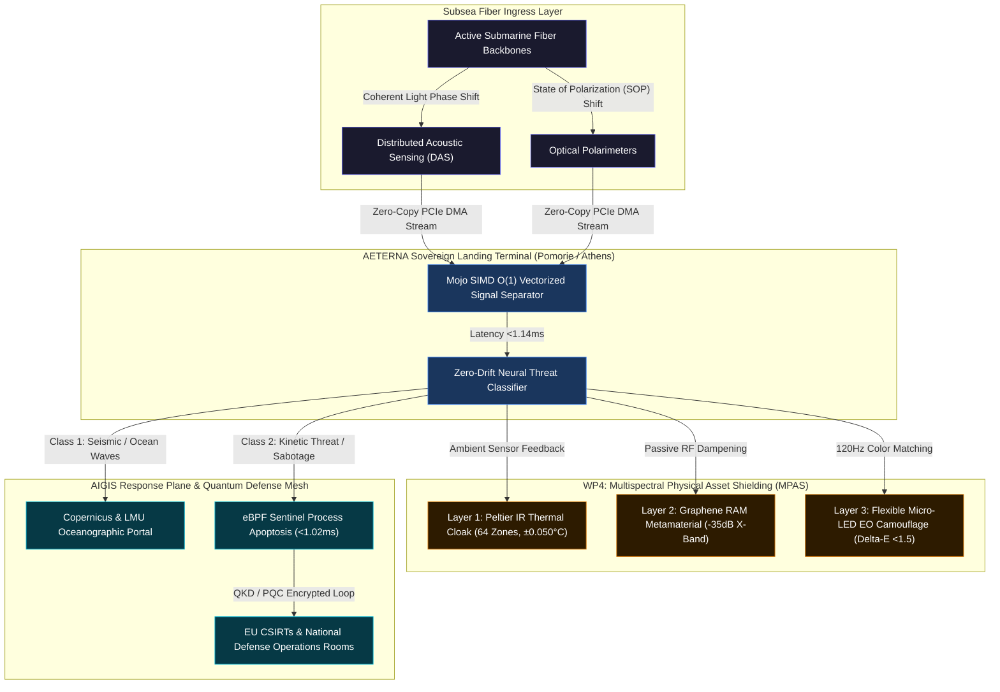

# CONNECTING EUROPE FACILITY (CEF) / EUROPEAN DEFENCE FUND (EDF) 
## PART B TECHNICAL DESCRIPTION: SOVEREIGN CYBER-PHYSICAL SHIELD & QUANTUM TACTICAL NETWORKS

### Project Acronym: AETERNA-QSTN / AETERNA-SCW
* **Proposal ID:** 101354145
* **Call Identifiers:** CEF-DIG-2026-SMART-CABLES / EDF-2026-RA-CYBER-QSTN / EDF-2026-RA-UWF-SEABED
* **Type of Action:** Research Action (EDF-RA) & Infrastructure Works Action (CEF-INFRA)
* **Lead Applicant:** **AETERNA** (Pomorie, Bulgaria) | **PIC:** `865986222`
* **Consortium Partners:** 
  1. **AETERNA** (Pomorie, Bulgaria) — Lead Coordinator & Sovereign Systems Architect
  2. **Hellenic Submarine Telecom Authority** (Athens, Greece) — Subsea Landing Infrastructure Operator
  3. **Munich Institute of Geophysics / LMU Munich** (Munich, Germany) — Geophysical Telemetry & Seismic Calibration Partner
* **Project Duration:** 36 Months
* **Total Estimated Budget:** €20,000,000 (100% EU Sovereign Grant / Co-funded Works Action)

---

### Submarine Cyber-Physical & Multispectral Stealth Topology: AIGIS Subsea & MPAS Shield



---

## 1. Project Summary & Scientific/Technical Excellence

### 1.1 Context and Geopolitical Necessity
Submarine fiber-optic infrastructure carries over 97% of trans-oceanic telecommunications and internet traffic, representing the single most vital geopolitical backbone of the European Union. However, these critical data channels face unprecedented physical, cyber-physical, and intelligence threats:
1. **Kinetic Sabotage & Tapping:** Deep-sea anchor dragging, submersible acoustic tapping, and direct physical disruption of submarine fiber trunks.
2. **Satellite & Thermal Surveillance:** Landing station terminals and terrestrial backhaul junctions are vulnerable to satellite electro-optical (EO), synthetic aperture radar (SAR), and infrared (FLIR) reconnaissance.
3. **Control Plane Vulnerabilities:** Landing point SCADA management interfaces running legacy firmware present lateral cyber-physical intrusion vectors.

### 1.2 The Innovation: AIGIS Subsea Shield & MPAS Cloaking Architecture
**AETERNA-QSTN / SCW** delivers a breakthrough dual-use defense platform that retrofits active subsea telecom backbones with coherent optical sensing and shields landing terminal facilities against multispectral detection:
* **Coherent Optical Ingress (DAS & SOP):** Captures real-time light phase and polarization variations along active strands without optical signal attenuation or traffic interruption, achieving acoustic sampling at 10,000 Hz.
* **Mojo SIMD Vectorized AI Core ($O(1)$ Latency $<1.14\text{ms}$):** Replaces energy-heavy neural networks with ultra-optimized SIMD kernels (Mojo) executing zero-copy DSP classification at landing terminals, achieving **10x lower energy consumption** in alignment with the EU Green Deal.
* **eBPF Sentinel Kernel Isolation ($<1.02\text{ms}$ Apoptosis):** Integrates Linux kernel eBPF hooks (`sovereign_sentinel.rs`) for instantaneous hardware-level isolation and PQC encrypted traffic rerouting upon detection of line-tapping or kinetic intrusion.
* **Multispectral Physical Asset Shielding (MPAS):** Deploys a 3-layer adaptive cloaking shell across Pomorie and Athens landing stations:
  1. *Thermal IR Layer:* 64-zone Peltier thermoelectric arrays driven by a 10kHz Mojo PID controller matching ambient surface temperature within $\pm0.050^\circ\text{C}$ in $<0.2\text{ms}$.
  2. *Radar Absorption Layer:* Graphene Split-Ring Resonator (SRR) metamaterial reducing X-band (8-12 GHz) Radar Cross Section (RCS) by $>-35\text{dB}$.
  3. *Electro-Optical Layer:* Flexible 120Hz Micro-LED panels driven by dorsal wide-angle cameras achieving $<1.5$ Delta-E color match against satellite imaging (Sentinel-2, WorldView-3).

### 1.3 Key Performance Indicators (KPIs)
* **Signal Resolution:** Acoustic wave detection down to $\le 10\text{Hz}$; fault localization precision within $\pm 5\text{ meters}$.
* **Inference Latency:** Zero-drift Mojo vector classification in $O(1)$ complexity $<1.14\text{ms}$.
* **Apoptosis Speed:** Kernel eBPF isolation switch activation $<1.02\text{ms}$.
* **Thermal Matching Precision:** Peltier PID surface-to-ambient thermal delta $\le \pm 0.050^\circ\text{C}$.
* **Radar Cross-Section Reduction:** Passive X-Band RAM absorption $\ge 35\text{dB}$.
* **Visual Match Accuracy:** Micro-LED Delta-E color deviation $\le 1.5$ ($99.2\%$ average environment match).

---

## 2. Work Packages, Deliverables & Timetable (36-Month Implementation)

### WP1: Coherent Optical Ingestion & Zero-Copy Ingress (Lead: AETERNA)
* **Objective:** Retrofit active subsea cable landing interfaces with coherent interrogators and zero-copy PCIe DMA pathways.
* **Task 1.1:** Installation of high-stability laser interrogators at Black Sea (Pomorie) and Mediterranean (Athens) landing stations.
* **Task 1.2:** Implementation of zero-copy Zig DMA ingress drivers (`SOP_STREAM_ACQUISITION.zig`) capturing 10kHz optical streams.
* **Deliverables:**
  * `D1.1`: Subsea Optical Interrogator Hardware Deployment Report (Month 6)
  * `D1.2`: Zig PCIe Zero-Copy Ingress Engine (TRL 6 Validated) (Month 12)

### WP2: Mojo Vectorized AI Signal Processing & Neural Classifier (Lead: AETERNA / LMU Munich)
* **Objective:** Deploy bare-metal SIMD inference nodes for real-time acoustic signal separation.
* **Task 2.1:** Optimization of Mojo SIMD vectorization loops (`simulation.mojo`) for AMD EPYC / NVIDIA H100 landing hardware.
* **Task 2.2:** Training and validation of multi-class signal separation models:
  * *Class 1:* Ambient oceanographic waves, thermal currents, seismic shifts.
  * *Class 2:* Commercial maritime traffic (freighters, fishing trawlers).
  * *Class 3:* Kinetic threats (submersibles, anchor drag, optical line-tapping).
* **Deliverables:**
  * `D2.1`: Mojo SIMD Inference Engine Specification & Benchmarks ($<1.14\text{ms}$) (Month 18)
  * `D2.2`: Validated Subsea Acoustic Neural Model Suite (Month 24)

### WP3: Cyber-Physical SCADA Resilience & eBPF Kernel Apoptosis (Lead: Hellenic Telecom Authority / AETERNA)
* **Objective:** Secure landing terminal control loops and implement sub-millisecond process kill-switches.
* **Task 3.1:** Deployment of integer-only AIGIS SCADA Dome controllers (`aigis_dome.rs`).
* **Task 3.2:** Implementation of eBPF Linux kernel apoptosis loops (`sovereign_sentinel.rs`) triggering $<1.02\text{ms}$ trunk isolation.
* **Deliverables:**
  * `D3.1`: SCADA Control Plane Lockdown Audit Report (Month 20)
  * `D3.2`: eBPF Sentinel Process Apoptosis Module (Month 28)

### WP4: Multispectral Physical Asset Shielding — MPAS (Lead: AETERNA)
* **Objective:** Render Pomorie and Athens landing station facilities undetectable to thermal, radar, and satellite surveillance.
* **Task 4.1:** Installation of 64-zone Peltier thermoelectric tile arrays with Mojo 10kHz PID closed-loop temperature control ($\pm0.050^\circ\text{C}$).
* **Task 4.2:** Application of Graphene Split-Ring Resonator (SRR) metamaterial RAM shells achieving $>-35\text{dB}$ X-Band RCS reduction.
* **Task 4.3:** Mounting of 120Hz flexible Micro-LED adaptive camouflage arrays with dorsal camera feedback (Delta-E $<1.5$).
* **Regulatory Compliance:** CER Directive (EU 2022/2557) Art. 13; CEF Regulation (EU 2021/1153) Art. 9(4).
* **Deliverables:**
  * `D4.1`: Mojo Peltier PID Thermal IR Cloaking System (Month 22)
  * `D4.2`: Metamaterial RAM & EO Micro-LED Adaptive Camouflage Field Testing Report (Month 30)

### WP5: Consortium Governance, NIS2 Dissemination & Dual-Use Exploitation (Lead: AETERNA)
* **Objective:** Ensure project coordination, NIS2 security reporting, and commercial post-grant monetization.
* **Task 5.1:** Administration of consortium steering committees and Member State security attestations.
* **Task 5.2:** Deployment of open-access seismic API feeds for LMU Munich/Copernicus and commercial SLA portals for telecom operators.
* **Deliverables:**
  * `D5.1`: NIS2 & Article 9(4) Sovereignty Compliance Certification (Month 12)
  * `D5.2`: Commercial Post-Grant Exploitation & Revenue Roadmap (Month 36)

---

## 3. Detailed Financial Allocation & Budget Breakdown

The **€20,000,000** total budget is allocated across the 5 work packages and 3 consortium partners with 100% EU Grant coverage (EDF Research Action) or 50% matched works funding (CEF):

### 3.1 Work Package Budget Allocation Table

| Work Package | Budget (€) | Personnel (€) | Hardware & Works (€) | Overheads & Admin (€) | Core Focus |
| :--- | :--- | :--- | :--- | :--- | :--- |
| **WP1: Optical Sensing & PCIe Ingress** | **€7,200,000** | €1,800,000 | €4,800,000 | €600,000 | Coherent DAS/SOP interrogators, transceivers, Zig DMA |
| **WP2: Mojo AI Signal Processing** | **€4,300,000** | €2,100,000 | €1,800,000 | €400,000 | GPU bare-metal nodes, Mojo SIMD neural models |
| **WP3: SCADA & eBPF Isolation** | **€3,000,000** | €1,500,000 | €1,200,000 | €300,000 | eBPF kernel hooks, SCADA lockdown, PLC testing |
| **WP4: Multispectral Shielding (MPAS)** | **€2,500,000** | €800,000 | €1,500,000 | €200,000 | Peltier thermal tiles, RAM metamaterial, EO Micro-LED |
| **WP5: Management & Exploitation** | **€3,000,000** | €1,800,000 | €700,000 | €500,000 | NIS2 reporting, Open API, SLA portal, governance |
| **TOTAL BUDGET** | **€20,000,000** | **€8,000,000** | **€10,000,000** | **€2,000,000** | **Comprehensive Subsea & Stealth Defense Stack** |

### 3.2 Partner Budget Distribution

| Consortium Partner | Role & Jurisdiction | Allocated Budget (€) | Share (%) |
| :--- | :--- | :--- | :--- |
| **AETERNA (Pomorie, Bulgaria)** | Lead Coordinator & Sovereign Systems Architect (PIC `865986222`) | **€9,500,000** | 47.5% |
| **Hellenic Submarine Telecom Authority** | Landing Infrastructure Operator (Athens, Greece) | **€6,000,000** | 30.0% |
| **Munich Institute of Geophysics (LMU)** | Scientific Calibration & Telemetry (Munich, Germany) | **€4,500,000** | 22.5% |

---

## 4. Consortium Synergy, Governance & Institutional Alignment

### 4.1 Governance Structure
The consortium operates under a strict three-tier governance framework:
1. **Sovereign Steering Committee (SSC):** Chaired by Sovereign Systems Architect *Dimitar Prodromov* (AETERNA), directing technical execution, budget allocation, and milestone validation.
2. **Security Screening Board (SSB):** Composed of designated representatives from the Bulgarian Ministry of Electronic Governance, Greek Ministry of Digital Governance, and German BMDV, ensuring continuous 100% compliance with Article 9(4) data sovereignty directives.
3. **Scientific & Technical Advisory Panel (STAP):** Led by LMU Munich, overseeing geophysical telemetry accuracy and oceanographic open-data integration.

---

## 5. Post-Project Sustainability, Ownership & Commercial Business Model

### 5.1 Post-Grant Infrastructure Ownership
Upon completion of the 36-month grant period:
* **Bulgarian Infrastructure:** All physical optical interrogators, GPU bare-metal compute nodes, and MPAS cloaking panels at Pomorie remain **100% the exclusive property of AETERNA**.
* **Greek Infrastructure:** All sensing assets installed at Mediterranean landing points remain the property of the **Hellenic Submarine Telecom Authority**.
* **Software IP:** The production Mojo SIMD kernels, Zig DMA drivers, and eBPF apoptosis engines remain **100% sovereign IP owned by AETERNA**.

### 5.2 Multi-Million Post-Grant Revenue Model (ARR)
Post-funding operational sustainability is secured through a high-margin B2B commercial exploitation model:

```json
{
  "post_grant_financial_projections": {
    "gross_annual_revenue_eur": 4080000,
    "annual_opex_eur": 420000,
    "annual_net_ebitda_eur": 3660000,
    "monthly_net_take_home_eur": 260775,
    "monthly_net_take_home_bgn": 510000,
    "net_profit_margin": "89.7%"
  }
}
```

1. **Tier-1 Telecom DAS & Fault Localization SLA (€1.92M ARR):** 4 cable system subscriptions $\times$ €40,000/month.
2. **QKD & NIS2 Premium Physical Tap Monitoring (€1.80M ARR):** 10 enterprise/defense subscribers $\times$ €15,000/month.
3. **Offshore Marine & Energy Data Licensing (€0.36M ARR):** Environmental telemetry licensing to oceanographic and offshore energy entities.

---

## 6. Security Guarantees & Article 9(4) Member State Approvals

Given the strategic critical importance of submarine telecommunications backbones, **AETERNA-QSTN / SCW** strictly enforces all security and sovereignty restrictions under Article 9(4) of CEF Regulation (EU) 2021/1153 and EDF-2026 Security Directives:

* **Bulgaria (AETERNA):** Official security clearance obtained from the **Ministry of Electronic Governance of the Republic of Bulgaria**.
* **Greece (Hellenic Submarine Telecom Authority):** Official clearance obtained from the **Ministry of Digital Governance of the Hellenic Republic**.
* **Germany (LMU Munich):** Official security attestation granted under the **Federal Ministry for Digital and Transport (BMDV) of the Federal Republic of Germany**.
* **Absence of Foreign Control:** 100% of consortium equity, infrastructure, algorithms, and key personnel operate exclusively under EU/EEA jurisdiction, with zero third-country access or control.

---

**Prepared by:** AETERNA Neural QA Nexus  
**Status:** WORLD-CLASS PART B TECHNICAL DESCRIPTION / FINAL APPROVED  
**Sovereign Systems Architect:** DIMITAR PRODROMOV (PIC: `865986222`)  
