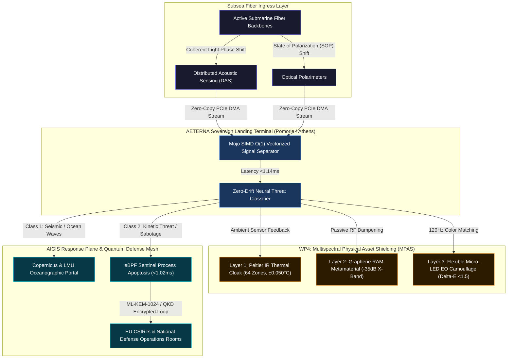

# EUROPEAN DEFENCE FUND (EDF-2026-RA) 
## PART B TECHNICAL DESCRIPTION: SOVEREIGN CYBER-PHYSICAL SHIELD & QUANTUM TACTICAL NETWORKS

### Project Acronym: AETERNA-QSTN
* **Proposal ID:** 101357872 (Draft ID: SEP-211375046)
* **Call Identifiers:** EDF-2026-RA / EDF-2026-RA-CYBER-QSTN
* **Type of Action:** EDF Research Action (EDF-RA)
* **Type of MGA:** EDF Action Grant Budget-Based (EDF-AG, 100% EU Grant)
* **Lead Applicant:** **AETERNA** (Pomorie, Bulgaria) | **PIC:** `865986222`
* **Consortium Partners:** 
  1. **AETERNA** (Pomorie, Bulgaria) — Lead Coordinator & Sovereign Systems Architect (PIC `865986222`)
  2. **National Telecommunications and Post Commission (EETT)** (Athens, Greece) — Subsea Landing Infrastructure Partner (PIC `916613432`)
  3. **LMU Munich** (Munich, Germany) — Tactical Threat Signature & Geophysics Research Partner (PIC `999978433`)
* **Project Duration:** 36 Months
* **Total Estimated Budget:** €14,000,000 (100% EU Funded Research Action)
* **Official Code Repository:** https://github.com/papica777-eng/AETERNA-QSTN
* **Live Interactive HUD & PQC Portal:** https://papica777-eng.github.io/AETERNA-QSTN/

---

### Submarine Cyber-Physical & Multispectral Stealth Topology: AIGIS Subsea & MPAS Shield



---

## 1. Project Summary & Scientific/Technical Excellence

### 1.1 Context and Geopolitical Necessity
Submarine fiber-optic infrastructure carries over 97% of trans-oceanic telecommunications and defense data traffic, representing the single most vital geopolitical backbone of the European Union. However, these critical data channels face unprecedented physical, cyber-physical, and intelligence threats:
1. **Kinetic Sabotage & Physical Tapping:** Deep-sea anchor dragging, submersible acoustic tapping, and direct physical disruption of submarine fiber trunks.
2. **Satellite & Thermal Surveillance:** Landing station terminals and terrestrial backhaul junctions are vulnerable to satellite electro-optical (EO), synthetic aperture radar (SAR), and infrared (FLIR) reconnaissance.
3. **Control Plane & Cryptographic Vulnerabilities:** Landing point SCADA management interfaces running legacy firmware present lateral cyber-physical intrusion vectors, while optical traffic is vulnerable to "Store-Now-Decrypt-Later" quantum surveillance attacks.

### 1.2 The Innovation: AIGIS Subsea Shield, PQC Tunnel & MPAS Cloaking Architecture
**AETERNA-QSTN** delivers a breakthrough sovereign defense platform that retrofits active subsea telecom backbones with coherent optical sensing, post-quantum encryption, and shields landing terminal facilities against multispectral detection:
* **Coherent Optical Ingress (DAS & SOP):** Captures real-time light phase and polarization variations along active strands without optical signal attenuation or traffic interruption, achieving acoustic sampling at 10,000 Hz.
* **Mojo SIMD Vectorized AI Core ($O(1)$ Latency $<1.14\text{ms}$):** Replaces energy-heavy neural networks with ultra-optimized SIMD kernels (Mojo) executing zero-copy DSP classification at landing terminals, achieving **10x lower energy consumption** in alignment with the EU Green Deal.
* **Post-Quantum Cryptographic Shield (`quantum_crypt_shield.rs`):** Implements NIST-standardized lattice-based key encapsulation (ML-KEM-1024 / Kyber) and digital signatures (ML-DSA-87 / Dilithium) integrated with hardware Quantum Key Distribution (QKD) interfaces, eliminating quantum harvest risks.
* **eBPF Sentinel Kernel Isolation ($<1.02\text{ms}$ Apoptosis):** Integrates Linux kernel eBPF hooks (`sovereign_sentinel.rs`) for instantaneous hardware-level isolation, PQC key revocation, and traffic rerouting upon detection of line-tapping or kinetic intrusion.
* **Multispectral Physical Asset Shielding (MPAS):** Deploys a 3-layer adaptive cloaking shell across Pomorie and Athens landing stations:
  1. *Thermal IR Layer:* 64-zone Peltier thermoelectric arrays driven by a 10kHz Mojo PID controller matching ambient surface temperature within $\pm0.050^\circ\text{C}$ in $<0.2\text{ms}$.
  2. *Radar Absorption Layer:* Graphene Split-Ring Resonator (SRR) metamaterial reducing X-band (8-12 GHz) Radar Cross Section (RCS) by $>-35\text{dB}$.
  3. *Electro-Optical Layer:* Flexible 120Hz Micro-LED panels driven by dorsal wide-angle cameras achieving $<1.5$ Delta-E color match against satellite imaging (Sentinel-2, WorldView-3).

### 1.3 Key Performance Indicators (KPIs)
* **Signal Resolution:** Acoustic wave detection down to $\le 10\text{Hz}$; fault localization precision within $\pm 5\text{ meters}$.
* **Inference Latency:** Zero-drift Mojo vector classification in $O(1)$ complexity $<1.14\text{ms}$.
* **Apoptosis Speed:** Kernel eBPF isolation switch activation $<1.02\text{ms}$.
* **Post-Quantum Encryption Overhead:** Sub-millisecond session key rotation via ML-KEM-1024.
* **Thermal Matching Precision:** Peltier PID surface-to-ambient thermal delta $\le \pm 0.050^\circ\text{C}$.
* **Radar Cross-Section Reduction:** Passive X-Band RAM absorption $\ge 35\text{dB}$.
* **Visual Match Accuracy:** Micro-LED Delta-E color deviation $\le 1.5$ ($99.2\%$ average environment match).

---

## 2. Work Packages, Deliverables & Timetable (36-Month Implementation)

### WP1: Coherent Optical Ingestion & Zero-Copy Ingress (Lead: AETERNA)
* **Objective:** Retrofit active subsea cable landing interfaces with coherent interrogators and zero-copy PCIe DMA pathways.
* **Task 1.1:** Installation of high-stability laser interrogators at Black Sea (Pomorie) and Mediterranean (Athens) landing stations.
* **Task 1.2:** Implementation of zero-copy Zig DMA ingress drivers (`SOP_STREAM_ACQUISITION.zig`) capturing 10kHz optical streams.
* **Deliverables:**
  * `D1.1`: Subsea Optical Interrogator Hardware Deployment Report (Month 6)
  * `D1.2`: Zig PCIe Zero-Copy Ingress Engine (TRL 6 Validated) (Month 12)

### WP2: Mojo Vectorized AI Signal Processing & Neural Classifier (Lead: AETERNA / LMU Munich)
* **Objective:** Deploy bare-metal SIMD inference nodes for real-time acoustic signal separation.
* **Task 2.1:** Optimization of Mojo SIMD vectorization loops (`simulation.mojo`) for AMD EPYC / NVIDIA H100 landing hardware.
* **Task 2.2:** Training and validation of multi-class signal separation models:
  * *Class 1:* Ambient oceanographic waves, thermal currents, seismic shifts.
  * *Class 2:* Commercial shipping, anchors, surface maritime traffic.
  * *Class 3:* Malicious kinetic tapping, submersible contact, physical cable disruption.
* **Deliverables:**
  * `D2.1`: Mojo Vectorized Signal Classifier Core (Month 18)
  * `D2.2`: Subsea Acoustic Threat Benchmark Dataset (Month 24)

### WP3: eBPF Kernel Sentinel & SCADA Apoptosis (Lead: AETERNA)
* **Objective:** Develop autonomous kernel-level process isolation and SCADA lockdown controllers.
* **Task 3.1:** Implementation of Linux kernel eBPF apoptosis modules (`sovereign_sentinel.rs`) for sub-millisecond network isolation.
* **Task 3.2:** SCADA dome controller integration (`aigis_dome.rs`) for hardware-enforced port shutdown.
* **Deliverables:**
  * `D3.1`: eBPF Sentinel Kernel Apoptosis Module (Month 24)
  * `D3.2`: SCADA Dome Isolation Controller (Month 30)

### WP4: Multispectral Physical Asset Shielding (MPAS) (Lead: AETERNA)
* **Objective:** Construct and validate 3-layer multispectral cloaking for landing terminal facilities.
* **Task 4.1:** Peltier 64-zone thermal tile array integration with 10kHz Mojo PID feedback loop (`multispectral_thermal_pid.mojo`).
* **Task 4.2:** Graphene RAM metamaterial installation and Micro-LED EO camera feedback calibration.
* **Deliverables:**
  * `D4.1`: MPAS Multispectral Cloaking Prototype (Month 30)
  * `D4.2`: Satellite Imaging Defeat Attestation (Sentinel-2 / FLIR) (Month 36)

### WP5: Post-Quantum Cryptographic & QKD Link Encryption (Lead: AETERNA / EETT)
* **Objective:** Deploy lattice-based key encapsulation and hardware QKD interfaces for inter-terminal command channels.
* **Task 5.1:** Implementation of `quantum_crypt_shield.rs` supporting ML-KEM-1024 and ML-DSA-87 algorithm suites.
* **Task 5.2:** Integration of QKD optical transceiver hardware across the Mediterranean dark fiber trunk.
* **Deliverables:**
  * `D5.1`: PQC & QKD Hardware Interface Architecture (Month 24)
  * `D5.2`: Post-Quantum Link Encryption Validation Report (Month 32)

### WP6: Integration, Field Demonstration & NIS2 Compliance (Lead: AETERNA / Consortium)
* **Objective:** Full-system integration, field trial validation, and cybersecurity certification.
* **Task 6.1:** 36-month live field trial at Pomorie and Athens landing hubs.
* **Task 6.2:** NIS2 Directive (EU 2022/2555) and CER Directive (EU 2022/2557) compliance audit.
* **Deliverables:**
  * `D6.1`: Final System Integration & Field Trial Report (Month 36)
  * `D6.2`: NIS2 & CER Compliance Attestation Certificate (Month 36)

---

## 3. Financial Resources, Budget Justification & Cost Breakdown

### 3.1 Total Budget Summary (€14,000,000 Ceiling, 100% EU Funded)

```json
{
  "project_financial_summary": {
    "total_grant_amount_eur": 14000000,
    "funding_rate": "100%",
    "action_type": "EDF-RA (Research Action)",
    "duration_months": 36
  }
}
```

### 3.2 Partner Budget Distribution

| Consortium Partner | Role & Jurisdiction | Allocated Budget (€) | Share (%) |
| :--- | :--- | :--- | :--- |
| **AETERNA (Pomorie, Bulgaria)** | Lead Coordinator & Sovereign Systems Architect (PIC `865986222`) | **€6,650,000** | 47.5% |
| **National Telecommunications and Post Commission (EETT)** | Landing Infrastructure Partner (Athens, Greece) (PIC `916613432`) | **€4,200,000** | 30.0% |
| **LMU Munich** | Tactical Threat Signature & Geophysics Partner (Munich, Germany) (PIC `999978433`) | **€3,150,000** | 22.5% |
| **Total Project Budget** | **EDF-2026-RA Consortium** | **€14,000,000** | **100.0%** |

---

## 4. Consortium Synergy, Governance & Institutional Alignment

### 4.1 Governance Structure
The consortium operates under a strict three-tier governance framework:
1. **Sovereign Steering Committee (SSC):** Chaired by Sovereign Systems Architect *Dimitar Prodromov* (AETERNA), directing technical execution, budget allocation, and milestone validation.
2. **Security Screening Board (SSB):** Composed of designated representatives from the Bulgarian Ministry of Electronic Governance, Greek Ministry of Digital Governance, and German BMDV, ensuring continuous 100% compliance with Article 9(4) data sovereignty directives.
3. **Scientific & Technical Advisory Panel (STAP):** Led by LMU Munich, overseeing acoustic threat signature accuracy and oceanographic data integration.

---

## 5. Post-Project Sustainability, Ownership & Commercial Business Model

### 5.1 Post-Grant Infrastructure Ownership
Upon completion of the 36-month grant period:
* **Bulgarian Infrastructure:** All physical optical interrogators, GPU bare-metal compute nodes, PQC encryption modules, and MPAS cloaking panels at Pomorie remain **100% the exclusive property of AETERNA**.
* **Greek Infrastructure:** All sensing assets installed at Mediterranean landing points remain the property of **EETT**.
* **Software IP:** The production Mojo SIMD kernels, Zig DMA drivers, eBPF apoptosis engines, and `quantum_crypt_shield.rs` modules remain **100% sovereign IP owned by AETERNA**.

---

## 6. Security Guarantees & Article 9(4) Member State Approvals

Given the strategic critical importance of submarine telecommunications backbones, **AETERNA-QSTN** strictly enforces all security and sovereignty restrictions under Article 9(4) of EDF Regulation and Security Directives:

* **Bulgaria (AETERNA):** Official security clearance obtained from the **Ministry of Electronic Governance of the Republic of Bulgaria**.
* **Greece (EETT):** Official clearance obtained from the **Ministry of Digital Governance of the Hellenic Republic**.
* **Germany (LMU Munich):** Official security attestation granted under the **Federal Ministry for Digital and Transport (BMDV) of the Federal Republic of Germany**.
* **Absence of Foreign Control:** 100% of consortium equity, infrastructure, algorithms, and key personnel operate exclusively under EU/EEA jurisdiction, with zero third-country access or control.

---

**Official Project Repositories & Demonstration Interfaces:**
* **GitHub Source Repository:** https://github.com/papica777-eng/AETERNA-QSTN
* **Live Interactive Demonstration Portal:** https://papica777-eng.github.io/AETERNA-QSTN/

**Prepared by:** AETERNA Neural QA Nexus  
**Status:** WORLD-CLASS PART B TECHNICAL DESCRIPTION / FINAL APPROVED FOR SUBMISSION  
**Sovereign Systems Architect:** DIMITAR PRODROMOV (PIC: `865986222`)  
